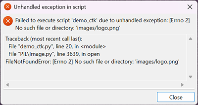

# Why We Need `resource_path()`

When building desktop applications with Python, relative paths like `"images/logo.png"` work effortlessly during development. The moment you freeze your app into an executable using **PyInstaller**, your app crashes on startup with `FileNotFoundError`.

Here is the exact technical breakdown of why this happens and how `resource_path()` eliminates the problem.

---

## 1. What PyInstaller Does Differently

PyInstaller produces fundamentally different filesystem layouts depending on how you build your application:

| Build Mode | How files are stored on disk | Where files live at runtime |
| :--- | :--- | :--- |
| **Development** (`python main.py`) | Loose source files on your hard drive. | Sitting in your project folder next to your script (`sys.argv[0]`). |
| **Single Executable** (`--onefile`) | Compressed into a single `.exe` self-extracting archive. | **Temporary sandbox folder (`sys._MEIPASS`)**: PyInstaller unpacks the runtime and your bundled assets into `AppData\Local\Temp\_MEI...` on launch. |
| **Folder Distribution** (`--onedir`) | Uncompressed directory of binaries and assets. | **Application bundle (`sys._MEIPASS`)**: Files sit inside `_internal/` next to the binary (`sys.executable`), or inside `Contents/Resources/` on macOS. |

---

## 2. The Root Problem: The Working Directory Trap

When your Python code calls:
```python
Image.open("images/logo.png")
```
Python resolves that relative path against your **Current Working Directory** (`os.getcwd()`).

### The `--onefile` Breakdown
When a user launches `app.exe` from their Desktop:
1. **The Process**: Runs on the Desktop. The working directory is `C:\Users\<User>\Desktop`.
2. **The Assets**: Extracted into `C:\Users\<User>\AppData\Local\Temp\_MEI123456\images\logo.png`.
3. **The Clash**: PyInstaller deliberately **does not** change the working directory (otherwise your app couldn't save user files to the Desktop). Python looks for `C:\Users\<User>\Desktop\images\logo.png`, finds nothing, and crashes immediately.



### The `--onedir` Breakdown
You launch `app.exe` directly inside the build output folder (`dist\app\`) right after compiling:
1. **The Process**: Runs directly inside the build folder. The working directory is `C:\Projects\app\dist\app`.
2. **The Assets**: PyInstaller 6+ isolates all bundled data inside `_internal\` at `C:\Projects\app\dist\app\_internal\images\logo.png`.
3. **The Clash**: Python checks the working directory for `images\logo.png` directly (`C:\Projects\app\dist\app\images\logo.png`). It never looks inside `_internal\`, finds nothing, and crashes immediately.


---

## 3. How `resource_path()` Solves It

`resource_path()` serves as an automated resolution switchboard:

```text
                                 |-- [Frozen: --onefile]  --> sys._MEIPASS / path
                                 |
resource_path("images/logo.png") +-- [Frozen: --onedir]   --> sys._MEIPASS / path
                                 |
                                 |-- [Dev. Mode]   --> sys.argv[0].parent / path
```

### Key Architectural Invariants

1. **Bundle-First Priority (Prevents Dev Leakage)**:  
   When frozen (`sys.frozen` or `_MEIPASS`), the function checks the internal package **first**. It will never secretly fall back to loose files on your development PC and fool you into believing an incomplete build is functional.

2. **Portability Protection**:  
   Warns immediately via `UserWarning` if someone hardcodes an absolute path (e.g. `D:/...`), preventing hardcoded drive roots or broken relative layouts.

---

## 4. Complete Behavior Summary

`resource_path()` provides two operating modes via the keyword parameter `strict` (defaults to `False` for clean backward compatibility):

| Scenario / Call | File Present? | What is Returned? | What is Raised? | Program Outcome |
| :--- | :--- | :--- | :--- | :--- |
| `resource_path("icon.png")` *(any mode)* | **Yes** | **`Path` object** | *Nothing* | Normal execution: resolves the real path. |
| `resource_path("icon.png")` *(default: `strict=False`)* | **No** | **`None`** | *Nothing* | Continues running: allows graceful fallback (e.g., `CTkPopup` stock icon). |
| `resource_path("icon.png", strict=True)` | **No** | **Nothing** *(aborts)* | **`FileNotFoundError`** | Halts immediately: prints every directory searched for rapid debugging. |

---

## 5. Usage in Code

### Standard Loading (Direct Application)
```python
from PIL import Image
import customtkinter as ctk
from resource_path import resource_path

# Resolve path seamlessly across Dev, --onefile, and --onedir
logo_path = resource_path("images/logo.png")

if logo_path is not None:
    img = ctk.CTkImage(Image.open(logo_path), size=(180, 180))
```

### Strict Mode (Fail-Fast Debugging)
```python
# Raises FileNotFoundError with a complete directory report if missing
logo_path = resource_path("images/logo.png", strict=True)
img = ctk.CTkImage(Image.open(logo_path), size=(180, 180))
```